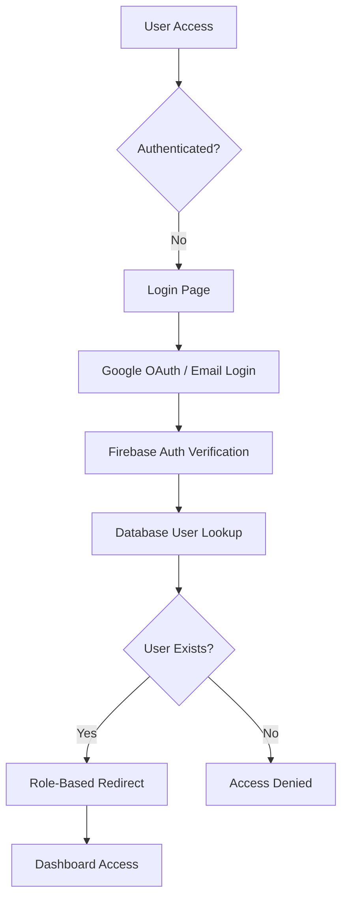
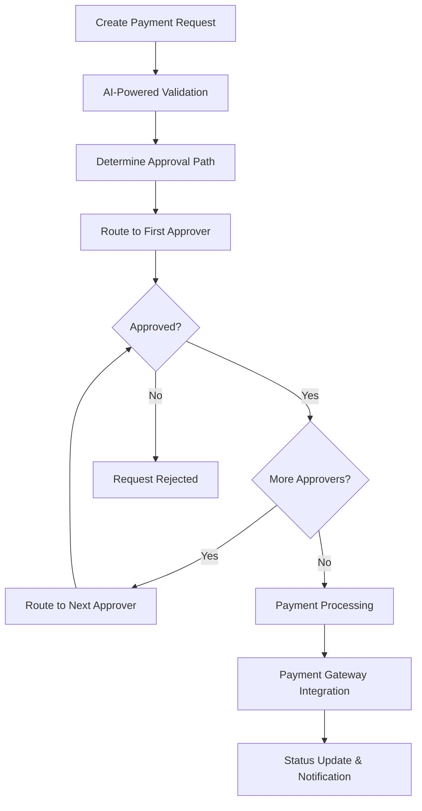
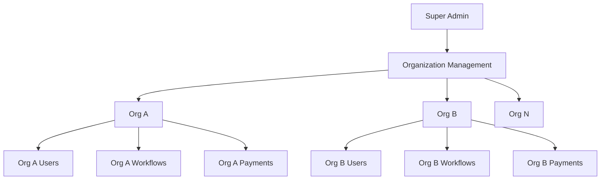

# Technical Documentation - Global Payment Management System

## 1. Project Description

### Problem Statement
Organizations struggle with inefficient payment management processes that lack transparency, proper approval workflows, and integration with modern payment methods. Traditional systems often fail to provide:
- **Transparent approval workflows** with real-time tracking
- **Multi-level authorization** based on amount thresholds and departments
- **Integration with Indian payment systems** (UPI, QR codes, bank transfers)
- **Role-based access control** for different organizational hierarchies
- **Audit trails** for compliance and financial tracking

### Solution Overview
The Global Payment Management System is an enterprise-grade web application that revolutionizes how organizations handle payment requests, approvals, and releases. It provides a comprehensive platform that combines modern web technologies with AI-powered features to create an efficient, transparent, and secure payment management ecosystem.

### Why It Matters
- **Reduces processing time** from days to hours through automated workflows
- **Ensures compliance** with built-in audit trails and approval hierarchies
- **Prevents fraud** through multi-level authorization and role-based access
- **Improves transparency** with real-time status updates and notifications
- **Supports Indian payment ecosystem** with UPI, QR codes, and popular gateways
- **Scales with organizations** through multi-tenant architecture

### How It Works
1. **Users create payment requests** with detailed information and attachments
2. **AI-powered system** routes requests through appropriate approval workflows
3. **Approvers receive notifications** and can approve/reject with comments
4. **Approved payments** are processed through integrated payment gateways
5. **Real-time updates** keep all stakeholders informed throughout the process
6. **Comprehensive reporting** provides insights and audit trails

## 2. Solution Architecture

### High-Level Architecture
```
┌─────────────────────────────────────────────────────────────┐
│                    Frontend Layer                           │
│  Next.js 14 + React 18 + TypeScript + Tailwind CSS        │
├─────────────────────────────────────────────────────────────┤
│                 Authentication Layer                        │
│     Firebase Auth + Google OAuth + Role-Based Access       │
├─────────────────────────────────────────────────────────────┤
│                  Business Logic Layer                      │
│   Payment Workflows + Approval Engine + AI Integration     │
├─────────────────────────────────────────────────────────────┤
│                   Data Access Layer                        │
│        Firestore + Firebase Storage + Real-time Sync      │
├─────────────────────────────────────────────────────────────┤
│                 External Integrations                      │
│    Payment Gateways + Email Services + AI Services        │
└─────────────────────────────────────────────────────────────┘
```

### System Workflow

#### 1. User Authentication Flow


#### 2. Payment Request Workflow


#### 3. Multi-Organization Architecture


### Component Architecture

#### Frontend Components
```
├── Pages (Next.js App Router)
│   ├── Authentication Pages
│   ├── Super Admin Dashboard
│   ├── Organization Dashboards
│   └── Payment Management Pages
├── Reusable Components
│   ├── Layout Components
│   ├── Form Components
│   ├── Data Display Components
│   └── Navigation Components
├── Context Providers
│   ├── AuthContext
│   ├── OrganizationContext
│   └── PaymentContext
└── Utility Libraries
    ├── Database Operations
    ├── Authentication Utils
    ├── Payment Processing
    └── AI Integration
```

#### Backend Services
```
├── Firebase Services
│   ├── Authentication Service
│   ├── Firestore Database
│   ├── Cloud Storage
│   └── Cloud Functions
├── AI Services
│   ├── Google Gemini Integration
│   ├── Email Template Generation
│   └── Smart Routing
├── Payment Services
│   ├── UPI Integration
│   ├── QR Code Generation
│   ├── Gateway Integration
│   └── Bank Transfer Processing
└── Notification Services
    ├── Email Notifications
    ├── Real-time Updates
    └── SMS Integration
```

## 3. AI Models and Tools Used

### Google Gemini AI Integration
**Model**: Google Gemini Pro
**Purpose**: AI-powered content generation and intelligent automation
**Implementation**: RESTful API integration with custom prompt engineering

#### Key AI Features:

1. **Email Template Generation**
   ```typescript
   const generateEmailTemplate = async (context: EmailContext) => {
     const prompt = `Generate a professional email template for ${context.type}
     Context: ${context.details}
     Tone: ${context.tone}
     Include: ${context.requirements}`;
     
     const result = await geminiModel.generateContent(prompt);
     return result.response.text();
   };
   ```

2. **Smart Approval Routing**
   ```typescript
   const determineApprovalPath = async (paymentRequest: PaymentRequest) => {
     const prompt = `Analyze payment request and suggest optimal approval path:
     Amount: ${paymentRequest.amount}
     Department: ${paymentRequest.department}
     Urgency: ${paymentRequest.urgency}
     Historical data: ${historicalPatterns}`;
     
     const suggestion = await geminiModel.generateContent(prompt);
     return parseApprovalSuggestion(suggestion);
   };
   ```

3. **Content Optimization**
   - **Payment descriptions** enhancement for clarity
   - **Notification messages** optimization for engagement
   - **Report summaries** generation from raw data
   - **Help documentation** auto-generation

### AI-Powered Features:

#### 1. Intelligent Email Templates
- **Dynamic content generation** based on payment context
- **Personalized messaging** for different stakeholders
- **Multi-language support** for global organizations
- **Tone adjustment** based on urgency and recipient role

#### 2. Smart Workflow Suggestions
- **Approval path optimization** based on historical data
- **Bottleneck identification** and resolution suggestions
- **Risk assessment** for unusual payment patterns
- **Compliance checking** against organizational policies

#### 3. Automated Content Creation
- **Payment summaries** for executive reports
- **Audit trail narratives** for compliance documentation
- **User onboarding content** for new organization members
- **Help documentation** based on common user queries

### AI Implementation Architecture
```typescript
// AI Service Layer
class AIService {
  private geminiModel: GoogleGenerativeAI;
  
  async generateEmailTemplate(context: EmailContext): Promise<string> {
    // Custom prompt engineering for email generation
  }
  
  async optimizeApprovalWorkflow(orgData: OrganizationData): Promise<WorkflowSuggestion> {
    // AI-powered workflow optimization
  }
  
  async analyzePaymentPatterns(payments: PaymentRequest[]): Promise<InsightReport> {
    // Pattern analysis and insights generation
  }
}
```

## 4. Instructions to Run the Prototype

### Prerequisites
- **Node.js** 18.0 or higher
- **npm** or **yarn** package manager
- **Firebase account** with billing enabled
- **Google Cloud Platform** account
- **Git** for version control

### Step 1: Environment Setup

1. **Clone the Repository**
   ```bash
   git clone https://github.com/raushan22882917/global-payment.git
   cd global-payment
   ```

2. **Install Dependencies**
   ```bash
   npm install
   # or
   yarn install
   ```

3. **Environment Configuration**
   ```bash
   cp .env.local.example .env.local
   ```

   Update `.env.local` with your configuration:
   ```env
   # Firebase Configuration
   NEXT_PUBLIC_FIREBASE_API_KEY=your_firebase_api_key
   NEXT_PUBLIC_FIREBASE_AUTH_DOMAIN=your_project.firebaseapp.com
   NEXT_PUBLIC_FIREBASE_PROJECT_ID=your_project_id
   NEXT_PUBLIC_FIREBASE_STORAGE_BUCKET=your_project.appspot.com
   NEXT_PUBLIC_FIREBASE_MESSAGING_SENDER_ID=your_sender_id
   NEXT_PUBLIC_FIREBASE_APP_ID=your_app_id
   NEXT_PUBLIC_FIREBASE_MEASUREMENT_ID=your_measurement_id

   # AI Configuration
   NEXT_PUBLIC_GEMINI_API_KEY=your_gemini_api_key

   # Google Cloud Configuration
   GOOGLE_CLOUD_PROJECT_ID=your_project_id
   ```

### Step 2: Firebase Setup

1. **Create Firebase Project**
   - Go to [Firebase Console](https://console.firebase.google.com/)
   - Create a new project
   - Enable Google Analytics (optional)

2. **Enable Authentication**
   ```bash
   # In Firebase Console:
   # Authentication → Sign-in method → Enable Google and Email/Password
   ```

3. **Setup Firestore Database**
   ```bash
   # In Firebase Console:
   # Firestore Database → Create database → Start in production mode
   ```

4. **Configure Firebase Storage**
   ```bash
   # In Firebase Console:
   # Storage → Get started → Start in production mode
   ```

5. **Deploy Security Rules**
   ```bash
   npm install -g firebase-tools
   firebase login
   firebase init
   firebase deploy --only firestore:rules,storage
   ```

### Step 3: Google Cloud Setup

1. **Enable Required APIs**
   ```bash
   # Enable these APIs in Google Cloud Console:
   # - Firebase Authentication API
   # - Cloud Firestore API
   # - Firebase Storage API
   # - Generative AI API (for Gemini)
   ```

2. **Create Service Account**
   ```bash
   # In Google Cloud Console:
   # IAM & Admin → Service Accounts → Create Service Account
   # Download the JSON key file
   # Place it in project root (it's gitignored)
   ```

3. **Get Gemini API Key**
   ```bash
   # Go to Google AI Studio: https://makersuite.google.com/app/apikey
   # Create API key for Gemini Pro
   # Add to .env.local
   ```

### Step 4: Database Initialization

1. **Create Super Admin User**
   ```bash
   node scripts/create-super-admin.js
   ```

2. **Setup Firestore Indexes**
   ```bash
   firebase deploy --only firestore:indexes
   ```

3. **Test Database Connection**
   ```bash
   node scripts/test-firebase-config.js
   ```

### Step 5: Run the Application

1. **Development Mode**
   ```bash
   npm run dev
   # Application will be available at http://localhost:3000
   ```

2. **Production Build**
   ```bash
   npm run build
   npm start
   ```

3. **Run Tests**
   ```bash
   npm run test
   # or run specific test scripts
   node scripts/test-complete-workflow.js
   ```

### Step 6: Initial Configuration

1. **Access Super Admin Dashboard**
   - Navigate to `http://localhost:3000`
   - Login with super admin credentials
   - Access dashboard at `/super-admin/dashboard`

2. **Create First Organization**
   - Go to Organizations → New Organization
   - Fill in organization details
   - Set up initial users and roles

3. **Configure Payment Methods**
   - Navigate to Organization Settings
   - Enable desired payment methods (UPI, Bank Transfer)
   - Configure payment gateways (Razorpay, Paytm, PhonePe)

4. **Setup Approval Workflows**
   - Use Visual Workflow Builder
   - Define approval levels and conditions
   - Test workflow with sample payment requests

### Step 7: Testing the System

1. **Authentication Testing**
   ```bash
   node scripts/debug-authentication.js
   ```

2. **Payment Workflow Testing**
   ```bash
   node scripts/test-complete-workflow.js
   ```

3. **AI Features Testing**
   - Create a payment request
   - Test email template generation
   - Verify AI-powered suggestions

### Troubleshooting

#### Common Issues and Solutions:

1. **Authentication Errors**
   ```bash
   node scripts/fix-user-uid-mismatches.js
   ```

2. **Firebase Storage Issues**
   ```bash
   node scripts/setup-firebase-storage-permissions.js
   ```

3. **Missing Payment Configurations**
   ```bash
   node scripts/fix-missing-payment-configs.js
   ```

4. **Database Connection Issues**
   ```bash
   node scripts/test-firebase-config.js
   ```

### Performance Optimization

1. **Enable Caching**
   ```bash
   # Configure Next.js caching in next.config.js
   # Enable Firebase offline persistence
   ```

2. **Optimize Bundle Size**
   ```bash
   npm run analyze
   # Review bundle analyzer output
   ```

3. **Database Optimization**
   ```bash
   # Create composite indexes for complex queries
   firebase deploy --only firestore:indexes
   ```

### Deployment Options

#### Vercel (Recommended)
```bash
# Connect GitHub repository to Vercel
# Configure environment variables
# Deploy automatically on push
```

#### Firebase Hosting
```bash
npm run build
firebase deploy --only hosting
```

#### Custom Server
```bash
npm run build
npm start
# Configure reverse proxy (nginx/Apache)
```

### Monitoring and Maintenance

1. **Performance Monitoring**
   - Firebase Performance Monitoring
   - Google Analytics integration
   - Custom metrics tracking

2. **Error Tracking**
   - Firebase Crashlytics
   - Custom error logging
   - Real-time alerts

3. **Regular Maintenance**
   ```bash
   # Run weekly maintenance scripts
   node scripts/check-user-data.js
   node scripts/test-complete-workflow.js
   ```

### Security Considerations

1. **Environment Variables**
   - Never commit `.env.local` to version control
   - Use different configurations for development/production
   - Rotate API keys regularly

2. **Firebase Security**
   - Review and update Firestore rules regularly
   - Monitor authentication logs
   - Enable audit logging

3. **Payment Security**
   - Use HTTPS in production
   - Implement rate limiting
   - Monitor for suspicious activities

---

## Support and Documentation

- **GitHub Repository**: https://github.com/raushan22882917/global-payment.git
- **Technical Issues**: Create GitHub issues
- **Documentation**: Check `/docs` folder for detailed guides
- **API Reference**: Available in codebase comments and TypeScript definitions

This technical documentation provides a comprehensive guide to understanding, setting up, and running the Global Payment Management System prototype. The system demonstrates advanced full-stack development capabilities with modern technologies and AI integration.